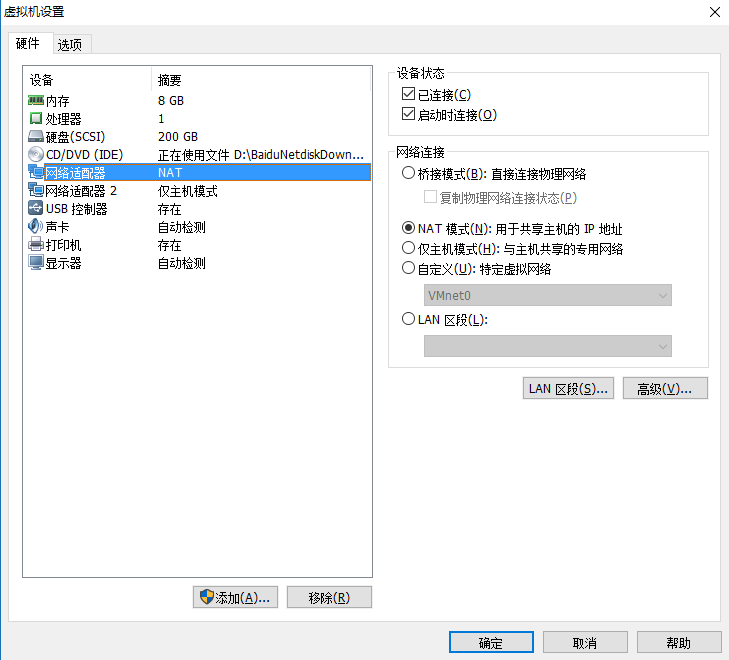
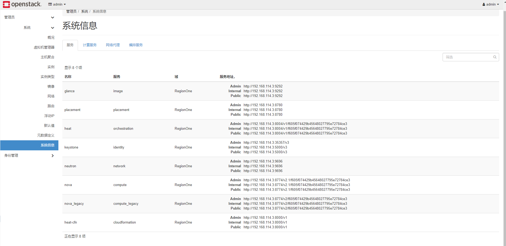

- 下载镜像 kolla-ocata(来自 http://www.chenshake.com/kolla-ocata-iso-release-notes/)
- vmware + kolla-ocata

从图中可以看到网卡配置了两个（一个为NAT模式，一个为仅主机模式）。内存分配了8G，硬盘分配了200GB。

- 通过iso引导，启动镜像，选择`install centos7.2 and kolla`
- 经过漫长的等待，成功开机
- 修改虚拟机的网络
    - 修改centOS 7的网络配置
        1. 进入目录`cd  /etc/sysconfig/network-scripts/`
        2. 然后查看对应网卡的文件`vi  ifcfg-ens33`
        3. 接着就是修改`IPADDR`,`GATEWAY0`,`BOOTPROTO`,`ONBOOT`, `DNS`,`PREFIXO0`等信息。修改的参考来自于vmware的虚拟网络编辑器
        4. 重启网络：`service network restart`
        5. 最后测试下网络是否能够ping通外网，ping通的话说明配置已经成功
- 修改部分配置文件以适应自己的环境
    - 修改`/etc/hosts`文件，`10.99.0.2 control01`修改为`ens33_IPADDR control01`
    - 修改`/etc/kolla/globals.yml`文件，将出现的`10.99.0.2`改为`ens33_IPADDR`

- 执行部署
```shell
 /root/kolla-ansible-4.0.3.dev36/tools/kolla-ansible deploy
 ```
 - 测试是否成功
dashboard访问地址 http://ens33_IPADDR/
username admin
password 99cloud

参考：
http://blog.csdn.net/dylloveyou/article/details/77148560
